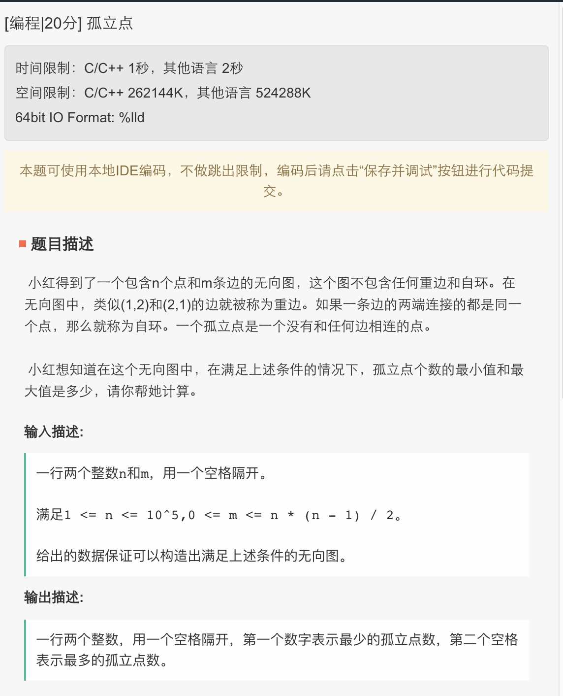

# Isolated Points in an Undirected Graph

Given the number of points `n` and number of edges `m` of an undirected graph, find the min and max number of possible isolated points.

Note:  
There are no repeated edges. For example, `(1, 2)` and `(2, 1)` are considered as same edge.  
There are no self linked point. For example, if the point of an edge's head and tail are the same, then it's a self linked point.

Example:  
`n = 4, m = 1`, return `"2 2"`;  
`n = 1, m = 0`, return `"1 1"`;
`n = 8, m = 4`, return `"0 4"`;
`n = 8, m = 6`, return `"0 4"`;

---
牛客网海归面试编程题第一题。
数学方法。。。。。  
  
